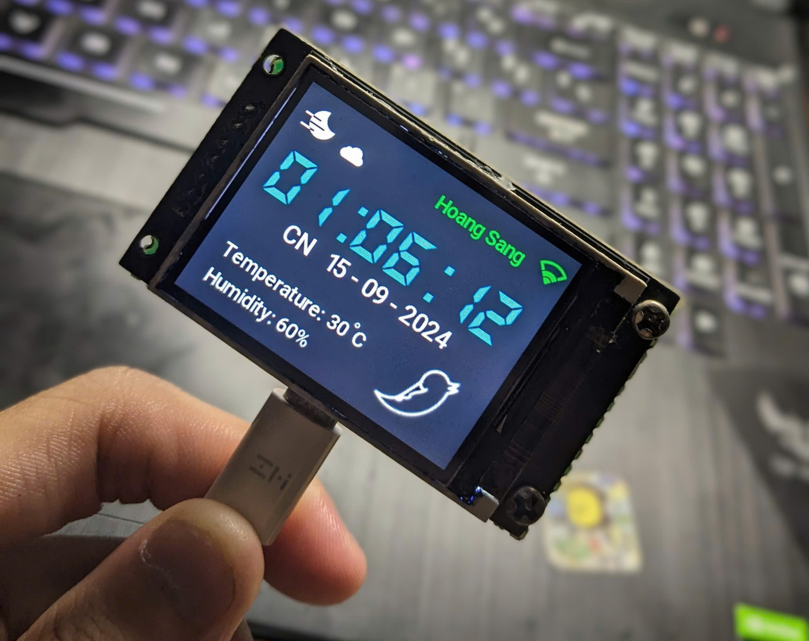

# ⏰ ESP32-C6 Smart Clock

A feature-rich smart desk clock built on the **ESP32-C6** microcontroller using **ESP-IDF v5.3**. The device combines real-time clock display, environmental sensing, interactive animations, and wireless connectivity into a compact embedded system with a vivid TFT LCD interface.



---

## ✨ Features

### 🕐 Real-Time Clock
- Accurate time synchronization via **SNTP** (Network Time Protocol) using `time.google.com`
- Large anti-aliased digital clock display (HH:MM:SS) with custom bitmap font rendering
- Date display with Vietnamese day-of-week format
- Automatic timezone configuration (UTC+7 — Vietnam)

### 🌡️ Environmental Monitoring
- **Temperature & Humidity** reading from **AHT30** sensor (I2C)
- Live display updated every 5 seconds on the home screen

### 🎨 Animated UI
- **Sun/Moon animation** — animated sprite with alpha-blended rendering, auto-switches based on time of day
- **Floating cloud** — smooth horizontal cloud animation
- **3D Wireframe Cube** — real-time 3D rotating wireframe with perspective projection, driven by **MPU6050** accelerometer/gyroscope orientation data (Xiaolin Wu anti-aliased line drawing)
- **Procedural bird** — Bézier curve-based flapping bird with MPU6050 tilt response
- Selectable animation modes (`ANIM_BIRD`, `ANIM_TEAPOT`)

### 🌗 Auto Day/Night Theme
- Automatic background color switching based on time of day (6 AM / 6 PM)
- Smooth theme transitions with full screen refresh

### ⏰ Alarm System
- Support for up to **10 alarms** stored persistently in **NVS** (Non-Volatile Storage)
- Buzzer alert with PWM-driven tone (3 kHz) on alarm trigger
- Dedicated alarm notification screen with clock display
- Dismiss alarm via rotary encoder button press

### 📡 Wireless Connectivity
- **Wi-Fi (802.11 b/g/n)** — STA mode for internet access and SNTP time sync
- **Bluetooth Low Energy (BLE)** — GATT server for external configuration (alarm management via BLE write characteristic)
- Real-time Wi-Fi signal strength indicator with color-coded RSSI icon (🟢 strong / 🟡 medium / 🟠 weak / 🔴 disconnected)
- SSID display on home screen

### 🎛️ User Input
- **Rotary encoder** with built-in push button — hardware-decoded via ESP32-C6 PCNT (Pulse Counter) peripheral with glitch filtering
- Navigation between screens (Home ↔ Alarm) via rotation
- Button press/hold detection with configurable hold threshold (300 ms)

### ⚙️ Settings
- Alarm volume control (0–100%) with visual progress bar
- Persistent settings storage via NVS

---

## 🔧 Hardware

### Microcontroller
| Component | Specification |
|-----------|---------------|
| MCU | **ESP32-C6** (RISC-V, single-core) |
| Flash | 4 MB |
| Framework | ESP-IDF v5.3.4 |

### Display
| Component | Specification |
|-----------|---------------|
| LCD | **ST7789** TFT LCD (320×240, RGB565) |
| Interface | SPI @ 40 MHz (half-duplex, 3-wire) |
| Backlight | PWM-controlled via LEDC |

### Sensors
| Sensor | Function | Interface |
|--------|----------|-----------|
| **AHT30** | Temperature & Humidity | I2C |
| **MPU6050** | 6-axis IMU (Accelerometer + Gyroscope) | I2C |
| **TEMT6000** | Ambient Light Sensor | ADC (Channel 6) |
| **VL53L0X** | Time-of-Flight Distance Sensor | I2C |

### Peripherals
| Component | Function |
|-----------|----------|
| Rotary Encoder (with button) | User navigation & input |
| Piezo Buzzer | Alarm audio output (PWM @ 3 kHz) |

### Pin Mapping

| Function | GPIO |
|----------|------|
| SPI CLK | 19 |
| SPI MOSI | 15 |
| SPI CS | 8 |
| LCD D/C | 14 |
| LCD Reset | 9 |
| LCD Backlight | 20 |
| I2C SCL | 4 |
| I2C SDA | 5 |
| Buzzer | 0 |
| Button (Rotary Push) | 1 |
| Rotary Encoder A | 2 |
| Rotary Encoder B | 3 |

---

## 📁 Project Structure

```
clock/
├── main/
│   └── main.c                  # Application entry point, task orchestration
├── components/
│   ├── AHT30/                  # Temperature & humidity sensor driver
│   ├── mpu6050/                # 6-axis IMU driver with complementary filter
│   ├── temt6000/               # Ambient light sensor (ADC)
│   ├── vl53l0x/                # Time-of-Flight distance sensor driver
│   ├── ili9341/                # TFT LCD driver (SPI, ST7789-compatible)
│   ├── icon_font/              # Bitmap fonts, color system, icon assets
│   │   ├── animated.h          # Sun/Moon animation sprite data
│   │   ├── digit_clock.h       # Large clock digit bitmaps
│   │   ├── font.h              # Text font bitmap data (25px, 30px)
│   │   ├── icon_screen1.h      # Wi-Fi signal strength icons
│   │   └── color.c/h           # RGB color definitions & buffer write macro
│   ├── home_screen/            # Home screen UI (clock, weather, animations)
│   ├── alarm_screen/           # Alarm list management screen
│   ├── settings_screen/        # Settings screen (volume control)
│   ├── ble_gatts_server/       # BLE GATT server for remote configuration
│   └── define/                 # Global pin definitions, enums, constants
├── bootloader_components/      # Custom bootloader hooks
├── partitions.csv              # Custom partition table (3 MB app)
├── sdkconfig                   # ESP-IDF project configuration
└── CMakeLists.txt              # Top-level CMake build file
```

---

## 🏗️ Architecture

The application is built on **FreeRTOS** with a multi-task architecture. Each UI element and peripheral runs as an independent task with semaphore-protected shared resources:

```
┌──────────────────────────────────────────────────┐
│                   app_main()                     │
│  ┌─────────────┐  ┌──────────┐  ┌────────────┐  │
│  │ WiFi + SNTP │  │ BLE GATT │  │ I2C Master │  │
│  └──────┬──────┘  └────┬─────┘  └─────┬──────┘  │
│         │              │              │          │
├─────────┴──────────────┴──────────────┴──────────┤
│                FreeRTOS Tasks                    │
│  ┌──────────┐ ┌──────────┐ ┌───────────────┐    │
│  │ Clock    │ │ WiFi     │ │ Temperature   │    │
│  │ Display  │ │ Status   │ │ & Humidity    │    │
│  ├──────────┤ ├──────────┤ ├───────────────┤    │
│  │ Sun/Moon │ │ Cloud    │ │ 3D Cube/Bird  │    │
│  │ Anim     │ │ Anim     │ │ Animation     │    │
│  ├──────────┤ ├──────────┤ ├───────────────┤    │
│  │ Key Scan │ │ Alarm    │ │ Theme Loop    │    │
│  │ (Input)  │ │ Loop     │ │ (Day/Night)   │    │
│  └──────────┘ └──────────┘ └───────────────┘    │
│                                                  │
│  ┌──────────────────────────────────────────┐    │
│  │  LCD Frame Buffer (115 KB, DMA-aligned)  │    │
│  │  SPI Refresh Task (20 FPS, 4 segments)   │    │
│  └──────────────────────────────────────────┘    │
└──────────────────────────────────────────────────┘
```

### Key Design Decisions
- **Double-buffered rendering**: All drawing operations write to a DMA-aligned RAM buffer (`lcd_buffer`); a dedicated refresh task pushes the buffer to the display via SPI in 4 horizontal segments
- **Semaphore-based concurrency**: `spi_xSemaphore` protects LCD buffer access; `i2c_xSemaphore` protects shared I2C bus
- **Static task allocation**: Screen-related tasks use `xTaskCreateStatic` to avoid heap fragmentation
- **Anti-aliased rendering**: Font and icon rendering uses alpha blending with color caching optimization for repeated pixel values

---

## 🚀 Getting Started

### Prerequisites
- [ESP-IDF v5.3+](https://docs.espressif.com/projects/esp-idf/en/latest/esp32c6/get-started/) installed and configured
- ESP32-C6 development board
- Hardware components connected per the pin mapping above

### Wi-Fi Configuration
Edit `main/main.c` and set your network credentials:
```c
#define ESP_WIFI_SSID "your_wifi_ssid"
#define ESP_WIFI_PASS "your_wifi_password"
```

### Build & Flash
```bash
# Set target to ESP32-C6
idf.py set-target esp32c6

# Build the project
idf.py build

# Flash to device (adjust port as needed)
idf.py -p COM3 flash

# Monitor serial output
idf.py -p COM3 monitor
```

---

## 📱 Screen Navigation

```
  ┌───────────┐  Rotate CW   ┌──────────────┐
  │   HOME    │ ────────────► │    ALARM     │
  │  SCREEN   │ ◄──────────── │   SCREEN     │
  └───────────┘  Rotate CCW   └──────────────┘
       │                            │
       │ Time-based                 │ Press button
       │ auto-switch                │ to edit alarm
       ▼                            ▼
  ┌───────────┐               ┌──────────────┐
  │   ALARM   │               │  FOCUS ALARM │
  │   RING    │               │   (Edit)     │
  └───────────┘               └──────────────┘
```

---

## 📄 License

This project is open source. Feel free to use, modify, and distribute.

---

## 🙏 Acknowledgments

- [Espressif ESP-IDF](https://github.com/espressif/esp-idf) — Development framework
- [ST7789 / ILI9341](https://www.displayfuture.com/) — TFT LCD controller documentation
- [InvenSense MPU6050](https://invensense.tdk.com/) — IMU sensor reference
- [VL53L0X API](https://www.st.com/en/imaging-and-photonics-solutions/vl53l0x.html) — STMicroelectronics ToF sensor driver
